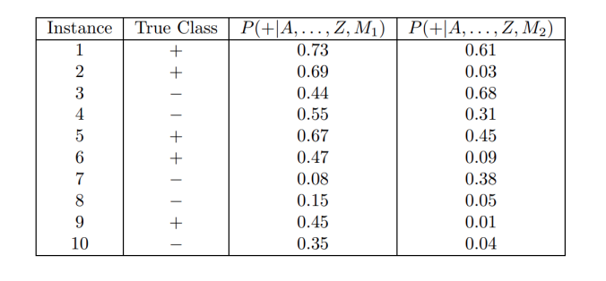

Validacioni skup mozemo koristiti da tokom treninga vidimo da li dolazi do overfitovanja

do sada smo koristili accuracy kao meru tacnosti -> acc = tacni/ukupno
ovo ne mora da bude dobro, npr imamo sistem za detektciju kriminalaca na aerordruomu, na aredodromu dnevno prodje 10000, od njih su samo 10 kriminalci. Ako mi imammo glup model koji govori da niko nije kriminalac, on ce imati ogrommu tacnost, ali je potpuno beskorisan.
=> accuracy moze da nas prevari

Za ovo mozemo korsitit matricu konfuzije 
        jeste nije
jeste     0    10
nije      0   9990
Saberi sve na dijagonali i podeli sa ostalim. Ovo ce nam dati isto visoku preciznost, ali mi mozemo videti da je ceo red 0.

U praksi imamo + i - klase (pozitivna, negativna)
TP (true positive) - broj instanci pozitivne klase koje je model pravilno klasifikovao
FN (false negative) - broj instanci pozitivne klase koje je model pogresno klasifikovao
FP (false positive) - broj instanci negativno klase koje je model pogresno klasifikovao
TN (true negative) - broj instanci negativne klase koje je model pravilno klasifikovao

- stopa stvarno pozitivnih ili osetljivost (true positive rate, sensitivity) TPR = TP / (TP + FN)
- stop stvarno negativnih ili specificnost (true negative reate, specificity) TNR = TN / (FP + TN)
- stopa lazno pozitivnih (false positive rate) FPR = FP / (FP + TN)
- stopa lazno negativnih (false negative rate) FNR = FN / (FN + TP)

preciznost (precision) = p = TP / (TP + FP)
odziv (recall) = r = TP / (TP + FN)

F_1 uzima u ozbir preciznost i odziv F_1 = 2rp / (r+p)
- hramonijska sredina preciznosti i odziva
- bliza je manjoj vrednosti

ROC kriva (receiver operatiin characteristic curve)
- graficki prikaz kompormisa izmedju tpr i fpr
- x osa - FPR ili 1-specificnost
- y osa - TPR ili osetljivost

AUC - area under curve kvafntifikuje ROC

Zadatak. Proceniti performanse dva klasifikaciona modela, M1 i M2. Skup podataka sadrzi 26 binarnih atributa, oznacenih od A do Z. Tabela prikazuje posteriorne verovatnove za pozitivnu klasu dobijene primenom modela na skup podataka. Nacrtati ROC krive.

